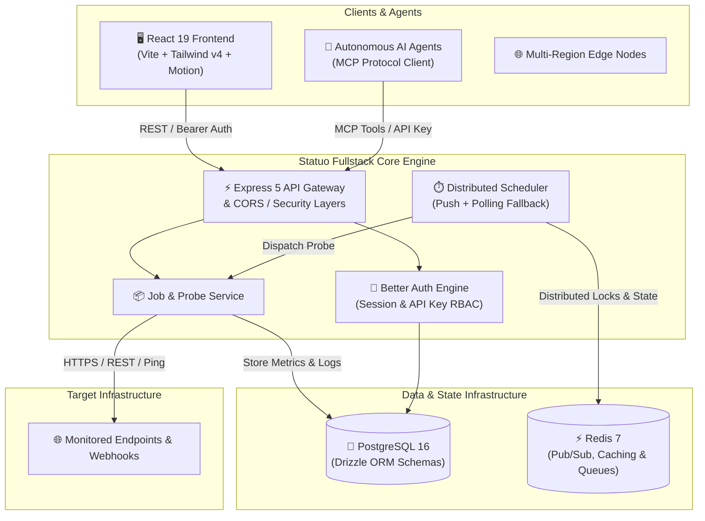

# ⚡ Statuo (Pulse)

<div align="center">


**High-Velocity Observability, Distributed Synthetic Telemetry, and Endpoint Health Monitoring**

[](https://www.typescriptlang.org/)
[](https://react.dev/)
[](https://vitejs.dev/)
[](https://tailwindcss.com/)
[](https://expressjs.com/)
[](https://www.postgresql.org/)
[](https://redis.io/)
[](https://orm.drizzle.team/)
[](https://www.better-auth.com/)
[](https://www.docker.com/)
[](LICENSE)

[Live Demo](#quick-start) • [Architecture](#-architecture) • [Getting Started](#-getting-started) • [API Reference](#-api-reference) • [Design System](#-design-system)

</div>

---

## 📖 Overview

**Statuo** is a developer-centric, high-velocity observability and synthetic monitoring platform. Designed for mission-critical web services, APIs, microservices, and AI agent workloads, Statuo delivers real-time health telemetry, continuous sub-second probe assertions, automated incident triage, and zero-trust credential handling.

Built on a token-driven, content-first high-density dark UI design system powered by **React 19**, **Tailwind CSS v4**, **Express 5**, **Drizzle ORM**, **PostgreSQL 16**, and **Redis 7**.

---

## ✨ Key Features

- 🛰️ **High-Frequency Synthetic Probing**: Sub-second HTTP/S, REST, WebSocket, and gRPC endpoint health checks with customizable payload assertions and timeout policies.
- 🔁 **Distributed Resilient Scheduler**: Hybrid execution engine combining push-based scheduling, distributed Redis locks, and a 30-second polling fallback with exponential backoff retries.
- 🔐 **Zero-Trust Credential Vault**: Target authentication headers and bearer tokens are encrypted at rest using AES-256-GCM.
- 📊 **Real-Time Telemetry & Metrics**: Comprehensive latency histograms (p50, p95, p99), uptime tracking, status codes, and execution timelines rendered with Recharts.
- 🛡️ **Sentinel Security & Rate Limiting**: Built-in protection against probe hammering, burst traffic, and unauthenticated telemetry queries.
- 👥 **Multi-Tenancy & Team Access**: Full organization and workspace isolation powered by **Better Auth** with role-based access control.
- 🤖 **Native AI / MCP Integration**: Exposes telemetry endpoints and diagnostic APIs compatible with Model Context Protocol (MCP) servers for autonomous coding assistants.
- 🎨 **Monolithic Precision UI**: Sharp, 0px-radius (`rounded-none`), high-contrast dark aesthetic following strict WCAG 2.2 AA accessibility standards.

---

## 🏗 Architecture



---

## 🛠️ Technology Stack

| Layer | Technologies | Description |
| :--- | :--- | :--- |
| **Frontend UI** | React 19, TypeScript, Vite 8, Tailwind CSS v4 | High-performance SPA with modern React hooks and compiler optimizations |
| **Design & UI Kit** | Radix UI, Lucide Icons, Huge Icons, Motion | Accessible primitives, monolithic zero-radius design, micro-animations |
| **State & Data** | TanStack React Query v5, Axios, React Hook Form, Zod | Query caching, optimistic UI updates, resilient schema validation |
| **Backend API** | Node.js, Express 5, TypeScript, tsx | Modern asynchronous REST API gateway and static bundle host |
| **Authentication** | Better Auth, `@better-auth/drizzle-adapter` | Session tokens, cookie management, API key issuance, OAuth ready |
| **Database & ORM** | PostgreSQL 16, Drizzle ORM, Drizzle Kit | Strongly typed SQL schemas, relations, migrations, and indexing |
| **Queues & Caching** | Redis 7, ioredis | Distributed scheduler locks, message broker, and fast cache layer |
| **Scheduling** | node-cron, Custom Push Scheduler | Configurable intervals, jitter mitigation, automatic retry handling |
| **Containerization** | Docker, Docker Compose, Alpine Linux | Multi-stage production build and one-command local orchestration |

---

## 📁 Repository Structure

```
pulse/
├── backend/                        # Express 5 & Better Auth Backend
│   ├── better-auth_migrations/     # Database migration scripts for auth
│   ├── drizzle/                    # Drizzle ORM migration files
│   ├── src/
│   │   ├── controllers/            # Request handlers (Job, User, Sync)
│   │   ├── db/                     # Drizzle schema (Jobs, Logs, Auth)
│   │   ├── libs/                   # Better Auth configuration & client
│   │   ├── middleware/             # Auth check, Rate limiter, Error handler
│   │   ├── routes/                 # API route declarations
│   │   ├── services/               # Scheduler engine & probing logic
│   │   ├── utils/                  # AES encryption & formatters
│   │   └── index.ts                # Application entrypoint & scheduler init
│   ├── drizzle.config.ts           # Drizzle database configuration
│   ├── Dockerfile                  # Backend production Dockerfile
│   └── package.json
├── frontend/                       # React 19 + Vite + Tailwind v4 App
│   ├── public/                     # Static public assets
│   ├── src/
│   │   ├── api/                    # API client instance & request methods
│   │   ├── components/             # Reusable UI & Landing components
│   │   │   ├── landing/            # Hero, Marquee, Features, Pricing, etc.
│   │   │   └── ui/                 # Monolithic design system components
│   │   ├── context/                # Auth & Theme React contexts
│   │   ├── hooks/                  # Custom React hooks
│   │   ├── pages/                  # Dashboard, Jobs, Analytics, Sentinel, etc.
│   │   ├── types/                  # Shared TypeScript interfaces
│   │   ├── App.tsx                 # Routing & global providers
│   │   ├── index.css               # Design tokens, variables & typography
│   │   └── main.tsx                # Frontend DOM mount
│   ├── design.md                   # Complete Better Auth Design System Spec
│   ├── Dockerfile                  # Frontend production Nginx Dockerfile
│   ├── vite.config.ts              # Vite configuration & path aliases
│   └── package.json
├── docker-compose.yml              # Unified orchestration (DB, Redis, App)
├── Dockerfile                      # Multi-stage unified fullstack Dockerfile
├── .env.example                    # Environment variable template
└── README.md                       # Documentation root
```

---

## 🚀 Getting Started

### Prerequisites

Ensure you have the following installed locally:
- [Node.js](https://nodejs.org/) (v20+ recommended)
- [pnpm](https://pnpm.io/) (`npm install -g pnpm`)
- [Docker](https://www.docker.com/) and [Docker Compose](https://docs.docker.com/compose/) (optional, for containerized setup)

---

### Option A: One-Command Docker Setup (Recommended)

1. **Clone the repository:**
   ```bash
   git clone https://github.com/your-org/pulse.git
   cd pulse
   ```

2. **Set up environment variables:**
   ```bash
   cp .env.example .env
   ```

3. **Start all services with Docker Compose:**
   ```bash
   docker compose up --build -d
   ```

4. **Access the application:**
   - Unified Web Dashboard & API: [http://localhost:3000](http://localhost:3000)
   - PostgreSQL Port: `5432`
   - Redis Port: `6379`

---

### Option B: Local Development Setup

#### 1. Start Database & Redis Only (Infrastructure)
```bash
docker compose -f docker-compose.dev.yml up -d
```

#### 2. Backend Setup
```bash
cd backend

# 1. Install dependencies
pnpm install

# 2. Configure environment
cp ../.env.example .env

# 3. Push database schema via Drizzle
pnpm drizzle-kit push

# 4. Start the backend in development mode
pnpm dev
```
The API server will boot on `http://localhost:3000`.

#### 3. Frontend Setup
In a new terminal window:
```bash
cd frontend

# 1. Install dependencies
pnpm install

# 2. Start the Vite dev server
pnpm dev
```
The frontend dev server will start on `http://localhost:5173`.

---

## ⚙️ Environment Variables

Create a `.env` file in the project root based on the template below:

| Variable | Default Value | Description |
| :--- | :--- | :--- |
| `PORT` | `3000` | Port for the backend API and unified server |
| `POSTGRES_DB` | `statuo_db` | Name of the PostgreSQL database |
| `POSTGRES_USER` | `statuo_user` | Database master user |
| `POSTGRES_PASSWORD` | `your_secure_password` | Database user password |
| `POSTGRES_PORT` | `5432` | Local exposed PostgreSQL port |
| `DATABASE_URL` | `postgresql://...` | Connection string for Drizzle ORM |
| `REDIS_PORT` | `6379` | Local exposed Redis port |
| `REDIS_URL` | `redis://localhost:6379` | Redis connection URL for queues & caching |
| `BETTER_AUTH_SECRET` | *(Random 32+ chars)* | Encryption secret for Better Auth sessions |
| `BETTER_AUTH_URL` | `http://localhost:3000` | Base URL for Better Auth callbacks |
| `BETTER_AUTH_API_KEY` | *(Optional API Key)* | Static key for machine-to-machine sync |
| `CORS_ORIGIN` | `http://localhost:5173` | Allowed frontend origin for CORS policies |

---

## 📡 API Reference

All protected endpoints require an active session cookie or a Bearer authorization token.

### 🔐 Authentication (`/api/auth/*`)
Mounted through Better Auth Node handler:
- `POST /api/auth/sign-up/email` — Register with email & password
- `POST /api/auth/sign-in/email` — Sign in with email & password
- `POST /api/auth/sign-out` — Invalidate active session
- `GET  /api/auth/get-session` — Retrieve authenticated user profile & permissions

### 📦 Monitoring Jobs (`/api/v1/jobs`)
| Method | Endpoint | Description |
| :--- | :--- | :--- |
| `GET` | `/api/v1/analytics` | Overall fleet availability, average latency, and MTTR stats |
| `GET` | `/api/v1/jobs` | List all active and paused monitoring jobs for the user |
| `POST` | `/api/v1/jobs` | Create and register a new endpoint probe |
| `GET` | `/api/v1/jobs/:id` | Fetch specific job details and recent configuration |
| `PATCH`| `/api/v1/jobs/:id` | Update job settings (interval, headers, timeout, retries) |
| `DELETE`| `/api/v1/jobs/:id` | Remove a job and cascade delete its historical logs |
| `POST` | `/api/v1/jobs/:id/toggle` | Pause or resume scheduled execution for a job |
| `POST` | `/api/v1/jobs/:id/trigger` | Trigger an immediate manual probe execution (Rate limited) |
| `GET` | `/api/v1/jobs/:id/logs` | Fetch paginated historical execution logs and response stats |

### 🩺 System Health
- `GET /health` — Service readiness probe checking API, DB, and Redis connectivity.

---

## 🎨 Design System & Philosophy

Statuo strictly adheres to the **Better Auth Monolithic Design System**:
- **Geist Typography Stack**: High-density typography with base size `12px` and `16px` line-height.
- **Zero Border Radius**: All cards, inputs, buttons, and dialogs are configured with `rounded-none` (0px radius) for a crisp, structural terminal feel.
- **Color Discipline**:
  - Surface Canvas: `#000000` (Deep pitch black)
  - Card & Container Surface: `oklab(0.273999 0.00165433 -0.00575992 / 0.3)`
  - Primary Accent: `#00E887` (Emerald Green) & `#38BDF8` (Cyan)
  - Destructive: `lab(56.2 68.3 40.1)` (Crimson)
- **Accessibility**: 100% WCAG 2.2 AA compliance with $\ge 7:1$ primary contrast ratio and explicit focus-visible rings.

For full token tables and specs, inspect [`frontend/design.md`](frontend/design.md).

---

## 🧪 Development & Scripts

### Backend Commands
```bash
cd backend
pnpm dev              # Start dev server with live-reload (tsx watch)
pnpm start            # Run compiled backend entrypoint
pnpm drizzle-kit push # Push schema migrations directly to database
```

### Frontend Commands
```bash
cd frontend
pnpm dev              # Launch Vite dev server with Hot Module Replacement
pnpm build            # Typecheck and produce optimized production bundle
pnpm lint             # Run ESLint across codebase
pnpm format           # Run Prettier code formatting
pnpm typecheck        # Run TypeScript typechecks without emitting code
```

---

## 🤝 Contributing

Contributions, bug reports, and feature requests are welcome!

1. Fork the repository
2. Create your feature branch (`git checkout -b feature/amazing-feature`)
3. Commit your changes (`git commit -m 'feat: add amazing new probe protocol'`)
4. Push to the branch (`git push origin feature/amazing-feature`)
5. Open a Pull Request

---

## 📄 License

Distributed under the **MIT License**. See `LICENSE` for more information.

<div align="center">
  <sub>Engineered with precision for modern infrastructure engineering.</sub>
</div>
